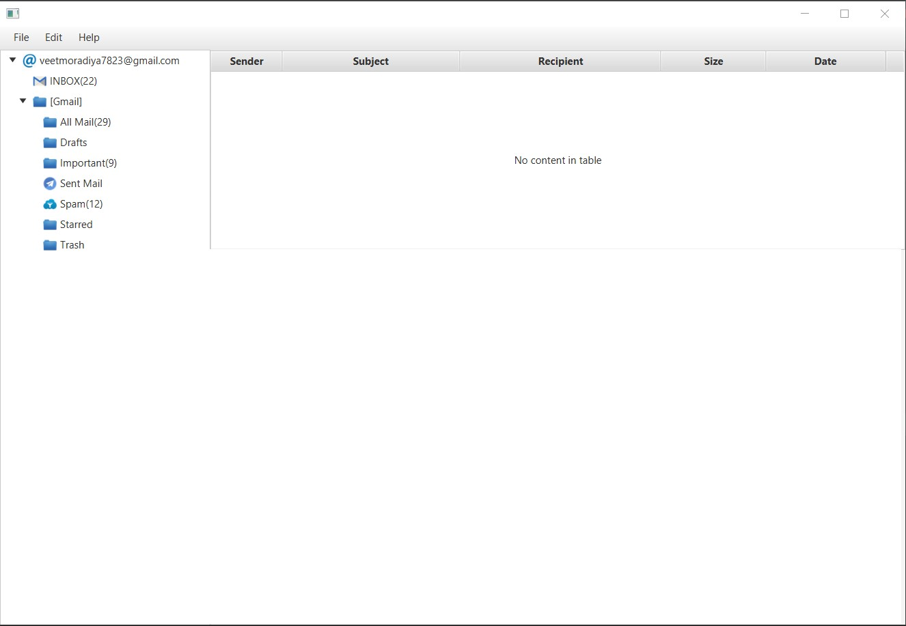

# EmailClient_Desktop
Java desktop application for Email. we can use this app for multiple purpose like to read mail, compose new mail and change the theme accordingly and many more.  
This application i have build using Model, View and Controller ( MVC Architecture )

###   Tools & Technologies</b>:
JavaFx, SMTP using Java, IntelliJ, SceneBuilder

<h2>Screen Shots</h2>

<h4>Login Page</h4>

<h4>Dashboard</h4>

<h4>Dashboard with specific mail open</h4>

<h4>File Section</h4>

<h4>Edit theme dialog box</h4>

<h4>Compose Mail Window</h4>

<h4>dark theme</h4>

<h4>light theme</h4>

